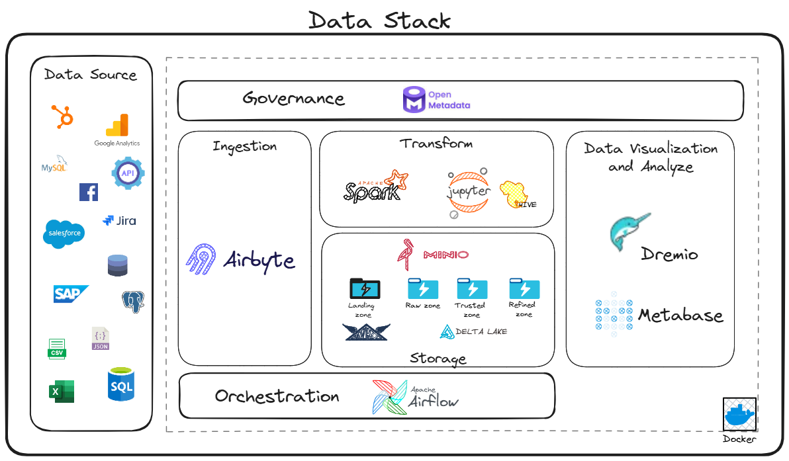

# Data Lake com MinIO, Spark e Dremio

Este projeto implementa um data lake utilizando MinIO como armazenamento de objetos, Apache Spark para processamento de dados e Dremio para consultas SQL. O ambiente é containerizado usando Docker e inclui um Hive Metastore para gerenciamento de metadados.

## Propósito do Projeto

Este projeto é destinado **exclusivamente para fins educacionais e de estudo**. A configuração atual utiliza uma implementação simplificada e containerizada que não é adequada para ambientes de produção.

Para utilização em ambientes de produção, seria necessário considerar vários fatores adicionais, incluindo:

- **Cluster Spark**: A implementação atual utiliza apenas uma instância Spark standalone. Para produção, seria necessário um cluster Spark adequadamente dimensionado e configurado.
- **Segurança**: As configurações de segurança atuais são básicas e precisariam ser reforçadas para ambientes de produção.
- **Escalabilidade**: O dimensionamento dos recursos computacionais deve ser adequado ao volume de dados.
- **Alta Disponibilidade**: Implementação de redundância e failover para todos os componentes.
- **Monitoramento e Alertas**: Ferramentas de monitoramento profissional para todo o ambiente.
- **Backup e Recuperação**: Estratégias robustas de backup para garantir a integridade dos dados.

## Arquitetura



O projeto consiste nos seguintes componentes:

- **MinIO**: Servidor de armazenamento de objetos compatível com S3
- **Apache Spark**: Framework para processamento distribuído de dados
- **Dremio**: Plataforma de análise de dados
- **Hive Metastore**: Gerenciamento de metadados para tabelas
- **MariaDB**: Banco de dados para o Hive Metastore
- **Airbyte**: Plataforma de integração de dados (gerenciada via abctl)
- **Metabase**: Ferramenta de visualização e dashboards

## Estrutura do Projeto

```
.
├── data/                  # Dados do MinIO
├── hive/                  # Configurações do Hive Metastore
│   ├── Dockerfile        # Imagem do Hive Metastore
│   ├── entrypoint.sh     # Script de inicialização
│   ├── hive-site.xml     # Configurações do Hive
│   ├── logs/             # Logs do Hive
│   └── warehouse/        # Diretório de warehouse do Hive
├── notebooks/            # Jupyter notebooks
├── scripts/              # Scripts Python
│   ├── download_from_minio.py  # Script para download de arquivos
│   └── requirements.txt        # Dependências Python
├── spark/                # Configurações do Spark
│   └── Dockerfile       # Imagem do Spark
├── dremio/                # Configurações do Dremio
│   ├── Dockerfile       # Imagem do Dremio
│   └── etc/             # Configurações do Dremio
│       ├── catalog/     # Configurações dos catalogs
│       │   ├── hive.properties    # Configuração do catalog Hive
│       │   └── minio.properties   # Configuração do catalog MinIO
│       ├── config.properties      # Configurações gerais
│       └── jvm.config             # Configurações da JVM
├── docker-compose.yml    # Configuração dos serviços
├── Makefile             # Comandos de automação
├── docs/                  # Documentação do projeto
│   ├── Guia de Instalação  # Instruções para configurar o ambiente
│   ├── Tutoriais          # Exemplos de uso e tutoriais
│   ├── Referência de API  # Documentação das APIs
│   └── Notas de Versão    # Histórico de mudanças e atualizações
└── README.md            # Documentação do projeto
```

## Requisitos

- Docker
- Docker Compose
- Make
- abctl (instalado automaticamente se necessário)

## Instalação

1. Clone o repositório:
```bash
git clone https://github.com/edvaldo-gutierres/data-lab
cd data-lab
```

2. Inicie os serviços:
```bash
make up
```

3. Se o Airbyte não iniciar automaticamente (o que pode acontecer no primeiro uso), instale-o manualmente:
```bash
make airbyte-install
```

Após a instalação, você pode verificar o status do Airbyte com:
```bash
make airbyte-status
```

E obter as credenciais de acesso com:
```bash
make airbyte-credentials
```

## Serviços Disponíveis

- **MinIO Console**: http://localhost:9001
  - Usuário: minioadmin
  - Senha: minioadmin

- **Jupyter Notebook**: http://localhost:8888
  - Acesso direto sem senha

- **Spark UI**: http://localhost:4040
  - Interface web do Spark

- **Dremio UI**: http://localhost:9047
  - Interface web do Dremio

- **Airbyte UI**: http://localhost:8000
  - Interface web do Airbyte
  - Credenciais: execute `make airbyte-credentials` para obter

- **Metabase**: http://localhost:3000
  - Interface web do Metabase
  - Configuração inicial na primeira execução

## Comandos Disponíveis

- `make up`: Inicia todos os serviços
- `make down`: Para todos os serviços
- `make logs-dremio`: Mostra logs do Dremio
- `make logs-spark`: Mostra logs do Spark
- `make logs-metabase`: Mostra logs do Metabase
- `make clean`: Remove containers e imagens
- `make airbyte-install`: Instala o Airbyte usando abctl (execute este comando primeiro se o Airbyte não subir)
- `make airbyte-start`: Inicia o Airbyte manualmente 
- `make airbyte-stop`: Para o Airbyte
- `make airbyte-status`: Verifica o status do Airbyte
- `make airbyte-credentials`: Mostra credenciais do Airbyte
- `make airbyte-logs`: Mostra logs do Airbyte
- `make metabase-reset`: Reinicia o Metabase

## Armazenamento

O MinIO é configurado com um bucket padrão chamado `raw` para armazenamento de dados brutos. Os dados são persistidos localmente no diretório `data/`.

## Processamento de Dados

O ambiente está configurado para suportar:

1. **Ingestão de Dados**:
   - Upload direto para o MinIO
   - Processamento via Spark
   - Armazenamento em formato Delta Lake
   - Integração com Airbyte para ETL

2. **Consultas**:
   - SQL via Dremio
   - Processamento distribuído via Spark
   - Notebooks Jupyter para análise

## Configurações

### MinIO
- Endpoint: http://localhost:9000
- Credenciais: minioadmin/minioadmin
- Bucket padrão: raw

### Spark
- Versão: 3.3.0
- Delta Lake: 2.3.0
- Portas: 8888 (Jupyter), 4040 (UI)

### Dremio
- Versão: [especificar versão]
- Porta: 9047

### Hive Metastore
- Versão: 3.1.3
- Porta: 9083
- Banco de dados: MariaDB

### Airbyte
- Gerenciado via abctl
- Porta: 8000
- Acesso: execute `make airbyte-credentials` para obter credenciais

### Metabase
- Versão: latest
- Porta: 3000
- Banco de dados: PostgreSQL
- Timezone: America/Sao_Paulo

## Desenvolvimento

Para desenvolvimento local:

1. Os notebooks Jupyter estão disponíveis em `notebooks/`
2. Os dados podem ser acessados via MinIO ou diretamente no filesystem
3. O Hive Metastore gerencia os metadados das tabelas
4. O Dremio permite consultas SQL sobre os dados
5. O Airbyte permite integrar dados de diversas fontes

## Troubleshooting

### Logs
- MinIO: `docker logs data-lab-minio-1`
- Spark: `docker logs data-lab-spark-1`
- Dremio: `docker logs data-lab-dremio-1`
- Hive: `docker logs data-lab-hive-metastore-1`
- Airbyte: `make airbyte-logs`
- Metabase: `make logs-metabase`

### Problemas Comuns
1. Se o Hive Metastore falhar ao iniciar:
   - Verifique os logs do MariaDB
   - Confirme se o banco de dados foi criado
   - Verifique as configurações no hive-site.xml

2. Se o Dremio não conseguir se conectar ao MinIO:
   - Verifique se o bucket 'raw' existe
   - Confirme as credenciais do MinIO
   - Verifique a conectividade entre os containers

3. Se o Airbyte apresentar problemas:
   - Verifique o status com `make airbyte-status`
   - Veja os logs com `make airbyte-logs`
   - Reinicie com `make airbyte-stop` seguido de `make airbyte-start`

## Contribuição

1. Fork o projeto
2. Crie uma branch para sua feature
3. Commit suas mudanças
4. Push para a branch
5. Abra um Pull Request

## Licença

Este projeto está licenciado sob a licença MIT - veja o arquivo LICENSE para detalhes.

## Acesso aos Serviços

### MinIO
1. **Console Web**:
   - URL: http://localhost:9001
   - Credenciais: minioadmin/minioadmin
   - Funcionalidades:
     - Upload/download de arquivos
     - Gerenciamento de buckets
     - Visualização de objetos
     - Configurações de acesso

2. **API S3**:
   - Endpoint: http://localhost:9000
   - Credenciais: minioadmin/minioadmin
   - Exemplo de uso com AWS CLI:
     ```bash
     aws s3 --endpoint-url http://localhost:9000 ls s3://raw/
     ```

### Jupyter Notebook
1. **Interface Web**:
   - URL: http://localhost:8888
   - Acesso direto sem senha
   - Funcionalidades:
     - Criação de notebooks
     - Execução de código Python
     - Visualização de dados
     - Integração com Spark

2. **Exemplo de Código**:
   ```python
   from pyspark.sql import SparkSession
   
   spark = SparkSession.builder \
       .appName("MinIO Example") \
       .config("spark.hadoop.fs.s3a.endpoint", "http://minio:9000") \
       .config("spark.hadoop.fs.s3a.access.key", "minioadmin") \
       .config("spark.hadoop.fs.s3a.secret.key", "minioadmin") \
       .getOrCreate()
   ```

### Spark UI
1. **Interface Web**:
   - URL: http://localhost:4040
   - Funcionalidades:
     - Monitoramento de jobs
     - Visualização de executors
     - Métricas de performance
     - Logs de aplicação

2. **Histórico de Jobs**:
   - URL: http://localhost:18080
   - Requer configuração adicional do History Server

### Dremio
1. **Interface Web**:
   - URL: http://localhost:9047
   - Funcionalidades:
     - Editor SQL
     - Visualização de datasets
     - Monitoramento de performance
     - Gerenciamento de fontes de dados

2. **Exemplo de Consulta**:
   ```sql
   -- Listar schemas disponíveis
   SHOW SCHEMAS;
   
   -- Listar tabelas
   SHOW TABLES;
   
   -- Consultar dados
   SELECT * FROM minha_tabela;
   ```

### Airbyte
1. **Interface Web**:
   - URL: http://localhost:8000
   - Credenciais: Execute `make airbyte-credentials` para obter
   - Funcionalidades:
     - Configuração de conectores de origem e destino
     - Sincronização de dados
     - Monitoramento de jobs
     - Agendamento de sincronizações

2. **Exemplo de Uso**:
   ```bash
   # Obter credenciais
   make airbyte-credentials
   
   # Verificar status
   make airbyte-status
   ```

### Hive Metastore
1. **API Thrift**:
   - Endpoint: thrift://localhost:9083
   - Usado internamente pelo Spark e Dremio

### Metabase
1. **Interface Web**:
   - URL: http://localhost:3000
   - Configuração inicial na primeira execução
   - Funcionalidades:
     - Criação de dashboards
     - Visualizações interativas
     - Conexão com diversas fontes de dados
     - Agendamento de relatórios

2. **Conectando ao MinIO via Dremio**:
   ```
   # Na configuração inicial ou em Configurações > Admin > Databases
   Tipo: Dremio JDBC
   Nome: Dremio
   Host: dremio
   Porta: 31010
   Banco de dados: (deixar em branco)
   Nome de usuário: (seu usuário do Dremio)
   Senha: (sua senha do Dremio)
   ```

3. **Criando Dashboards**:
   - Após configurar a conexão com o Dremio, você pode criar consultas e dashboards a partir dos dados armazenados no MinIO
   - Utilize o editor visual ou SQL para gerar suas visualizações
   - Construa dashboards combinando diferentes visualizações
   - Configure atualizações automáticas para seus dashboards

4. **Compartilhamento e Alertas**:
   - Compartilhe dashboards com outros usuários
   - Configure alertas para monitorar suas métricas
   - Agende o envio de relatórios por e-mail