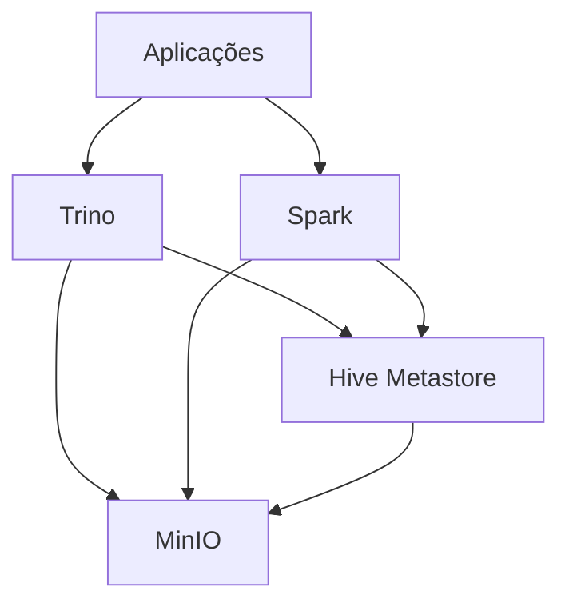

# Bem-vindo ao Data Lake

Esta é a documentação oficial do projeto Data Lake, uma solução moderna e escalável para armazenamento e processamento de dados usando MinIO, Apache Spark e Trino.

## Visão Geral

O projeto implementa um data lake completo usando tecnologias open source:

- **MinIO**: Armazenamento de objetos compatível com S3
- **Apache Spark**: Processamento distribuído de dados
- **Trino**: Consultas SQL distribuídas
- **Hive Metastore**: Gerenciamento de metadados
- **Delta Lake**: Formato de tabela com transações ACID

## Arquitetura

## Principais Recursos

- ✨ **Armazenamento Escalável**: Armazenamento de objetos compatível com S3 usando MinIO
- 🚀 **Processamento Distribuído**: Processamento de dados com Apache Spark
- 📊 **Consultas SQL**: Consultas distribuídas com Trino
- 🔒 **Transações ACID**: Suporte a transações usando Delta Lake
- 📝 **Metadados**: Gerenciamento de metadados com Hive Metastore
- 🐳 **Containerizado**: Ambiente completo em containers Docker

## Começando

Para começar a usar o Data Lake, siga nosso [Guia de Instalação](getting-started/installation.md).

## Componentes

Aprenda mais sobre cada componente do sistema:

- [MinIO](components/minio.md): Armazenamento de objetos
- [Spark](components/spark.md): Processamento de dados
- [Trino](components/trino.md): Consultas SQL
- [Hive Metastore](components/hive.md): Gerenciamento de metadados

## Tutoriais

Explore nossos tutoriais práticos:

- [Ingestão de Dados](tutorials/data-ingestion.md)
- [Consultas SQL](tutorials/sql-queries.md)
- [Delta Lake](tutorials/delta-lake.md)

## Contribuição

Interessado em contribuir? Confira nosso [Guia de Contribuição](development/contributing.md).
