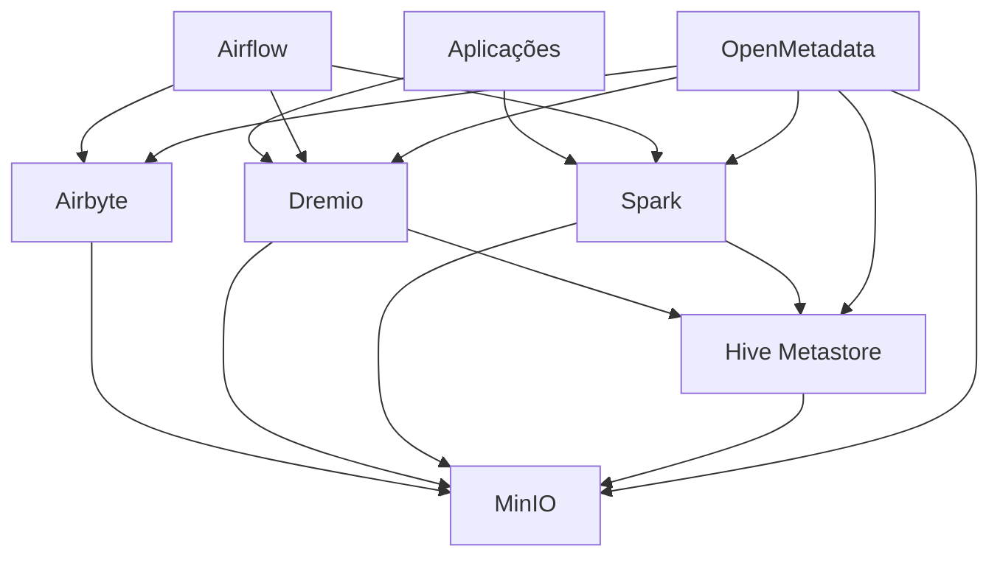

# Bem-vindo ao Data Lake

Esta é a documentação oficial do projeto Data Lake, uma solução moderna e escalável para armazenamento, processamento, integração, orquestração e governança de dados.

## Visão Geral

O projeto implementa um data lake completo usando tecnologias open source:

- **MinIO**: Armazenamento de objetos compatível com S3
- **Apache Spark**: Processamento distribuído de dados
- **Dremio**: Consultas SQL distribuídas
- **Hive Metastore**: Gerenciamento de metadados
- **Delta Lake**: Formato de tabela com transações ACID
- **Airflow**: Orquestração de fluxos de trabalho
- **Airbyte**: Integração e ingestão de dados
- **OpenMetadata**: Catalogação e governança de dados

## Arquitetura

## Principais Recursos

- ✨ **Armazenamento Escalável**: Armazenamento de objetos compatível com S3 usando MinIO
- 🚀 **Processamento Distribuído**: Processamento de dados com Apache Spark
- 📊 **Consultas SQL**: Consultas distribuídas com Dremio
- 🔒 **Transações ACID**: Suporte a transações usando Delta Lake
- 📝 **Metadados**: Gerenciamento de metadados com Hive Metastore
- 🐳 **Containerizado**: Ambiente completo em containers Docker
- 🔄 **Orquestração**: Fluxos de trabalho e agendamento com Apache Airflow
- 📥 **Ingestão de Dados**: Integração com diversas fontes de dados via Airbyte
- 📚 **Governança**: Catalogação e linhagem de dados com OpenMetadata

## Começando

Para começar a usar o Data Lake, siga nosso [Guia de Instalação](getting-started/installation.md).

## Componentes

Aprenda mais sobre cada componente do sistema:

- [MinIO](components/minio.md): Armazenamento de objetos
- [Spark](components/spark.md): Processamento de dados
- [Dremio](components/dremio.md): Consultas SQL
- [Hive Metastore](components/hive.md): Gerenciamento de metadados
- [Airflow](components/airflow.md): Orquestração de fluxos de trabalho
- [Airbyte](components/airbyte.md): Integração de dados
- [OpenMetadata](components/openmetadata.md): Catalogação e governança

## Tutoriais

Explore nossos tutoriais práticos:

- [Ingestão de Dados](tutorials/data-ingestion.md)
- [Consultas SQL](tutorials/sql-queries.md)
- [Delta Lake](tutorials/delta-lake.md)

## Contribuição

Interessado em contribuir? Confira nosso [Guia de Contribuição](development/contributing.md).
